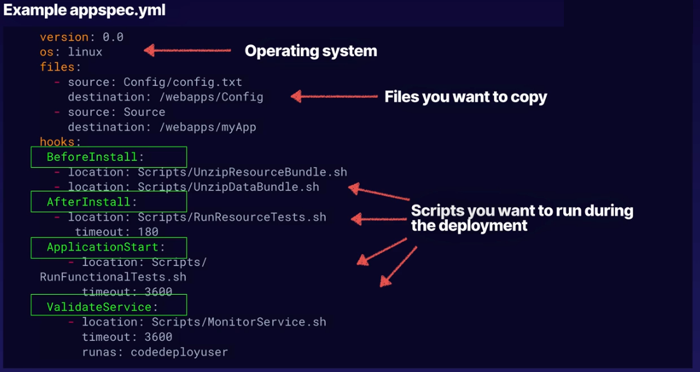

[//]:# (What is CI? What is CD "delivery"? What is CD "deployment"?)

    

        <b><big><big>
           What is stage, action and transition in CodePipeline?
        </big></big></b>
    

CI/CD — это метод частой доставки приложений клиентам путем внедрения автоматизации
на этапах разработки приложений.
Основными концепциями CI/CD являются непрерывная интеграция CI,
непрерывная поставка CD и непрерывное развертывание CD.
CI/CD — это решение проблем, которые интеграция нового кода может вызвать
для групп разработки и эксплуатации («интеграционный ад»).

 

[//]:# ( What is deployment configuration for the AWS CodeDeploy?)

    

        <b><big><big>
             What is deployment configuration for the AWS CodeDeploy?
        </big></big></b>
    

Конфигурация развертывания — это набор правил развертывания и
условий успешного и неудачного развертывания,
используемых CodeDeploy во время развертывания.

Существуют следующие конфигурации развертывания:

**In-place** (На месте): При таком развертывании новая версия приложения 
заменяет старую версию на текущих серверах. 
Это может привести к временному простою во время развертывания.

**Canary**: трафик смещается в два этапа.
Вы можете выбрать один из предопределенных параметров,
которые определяют процент трафика,
перенесенный на вашу обновленную функцию Lambda или набор задач
ECS в первом шаге, и интервал в минутах,
прежде чем оставшийся трафик будет перемещен во втором шаге.

Это позволяет проверить новую версию на небольшой
группе пользователей перед полным перенаправлением трафика.

**Linear**: трафик смещается равными шагами с равным количеством
минут между каждым шагом.
Вы можете выбрать один из предопределенных линейных параметров,
которые определяют процент трафика, смещенного в каждом приращении,
и количество минут между каждым приращением.

Это позволяет мониторить и быстро откатить развертывание, если обнаружены проблемы.

**All-at-once**: весь трафик переносится с исходной функции
Lambda или набора задач ECS на обновленную функцию или набор задач
одновременно.

Это быстрый способ развертывания, но если в обновленной версии есть проблемы, 
они могут сразу же повлиять на всех пользователей.

 

[//]:# (What parts CodeDeploy consists off?)

    

        <b><big><big>
             What parts CodeDeploy consists off?
        </big></big></b>
    

- Code Commit - source and version control
- Code Build - automated build
- Code Deploy - automated deployment to Ec2, on-premise, lambda
- Code Pipeline - manages the workflow

 

[//]:# (What is code commit?)

    

        <b><big><big>
             What is code commit?
        </big></big></b>
    

- Code Commit - source and version control

 

[//]:# (What is deployment strategies for the AWS CodeDeploy?)

    

        <b><big><big>
            What is deployment strategies for the AWS CodeDeploy?
        </big></big></b>
    

Тип развертывания — это метод, используемый для обеспечения
доступности последней версии приложения на экземплярах в
группе развертывания.

Существует два типа развертывания:
- **In-Place Развертывание на месте**: приложение на каждом экземпляре в
  группе развертывания останавливается,
  устанавливается последняя версия приложения,
  а новая версия приложения запускается и проверяется.
  - capacity is reduced (need to configure load balancer not to send messages to redeployed instances)
  - it will redeploy instances by chain
  - there is no quick fix
  - lambda is not supported
  - great when deploying the first time

- **Blue-Green Сине-зеленое развертывание**: поведение вашего развертывания
  зависит от того, какую вычислительную платформу вы используете:
    - **платформе EC2/On-Premises:**
        - На заменяющих экземплярах установлена последняя версия приложения.
        - Экземпляры в замещающей среде регистрируются в балансировщике
          нагрузки Elastic Load Balancing, в результате чего
          трафик перенаправляется на них.
          Экземпляры в исходной среде отменяются, и их можно остановить
          или продолжить работу для других целей.

    - **Вычислительная платформа AWS Lambda или Amazon ECS**:
      трафик перемещается постепенно в соответствии с конфигурацией

    - **Синие/зеленые развертывания через AWS CloudFormation:**
      трафик перемещается с ваших текущих ресурсов на ваши
      обновленные ресурсы в рамках обновления стека AWS CloudFormation.
    
    - easy roll back
    - no capacity reduction
    - green instances can be created ahead of time
    - you pay for old and new servers until termination 
      

 

[//]:# (What is deployment application specification for the AWS CodeDeploy? AppSpec) 

    

        <b><big><big>
            What is deployment application specification for the AWS CodeDeploy? "appSpec.yaml"
        </big></big></b>
    

Файл спецификации приложения (файл AppSpec), уникальный для CodeDeploy,

- for EC2 YAML only
- for lambda YAML / JSON

Файл AppSpec используется для управления каждым развертыванием
как набором обработчиков событий жизненного цикла,
которые определены в файле.

 

[//]:# (What are the key elements of an app spec "appSpec.yaml" in CodeDeploy?)

    

        <b><big><big>
           What are the key elements of an app spec "appSpec.yaml" in CodeDeploy?
        </big></big></b>
    

    version: reserved for future use
    os: OS version
    files: config files and packages
    permissions: 
    hooks: LiceCycle event hooks

 

[//]:# (What are hooks events that you can specify in "appSpec.yaml"?)

    

        <b><big><big>
           What are hooks events that you can specify in "appSpec.yaml"?
        </big></big></b>
    

This is special events that can be specified while code deploys.

They can be separated in 3 phases: 
- De-register instances from Load Balancer
- Application deployment phase
  - Application Stop
  - Download Bundle
  - Before/IN/After install steps
  - App start
  - Validate Service
- Re-register load balancer

 

[//]:# (What is deployment application for the AWS CodeDeploy?)

    

        <b><big><big>
            What is deployment application for the AWS CodeDeploy?
        </big></big></b>
    

Приложение — это просто имя или контейнер, используемый CodeDeploy
для обеспечения ссылки на правильную версию,
конфигурацию развертывания и группу развертывания во время развертывания.

 

[//]:# (What is revision for the AWS CodeDeploy? "редактируете")

    

        <b><big><big>
           What is revision for the AWS CodeDeploy? "редактируете"
        </big></big></b>
    

В CodeDeploy содержится версия исходных файлов,
которые CodeDeploy развернет на ваших экземплярах.

Вы планируете редактирование, добавляете в собственный файл AppSpec,
а затем отправляете редактирование в Amazon S3 или GitHub.
После отправки версии ее можно развернуть.

 

[//]:# (What is deployment group for the AWS CodeDeploy?)

    

        <b><big><big>
           What is deployment group for the AWS CodeDeploy?
        </big></big></b>
    

Группа развертывания — это сущность AWS CodeDeploy для группировки EC2
экземпляров или функций AWS Lambda в развертывании CodeDeploy.

Для развертываний EC2 это набор экземпляров,
связанных с приложением, на которое вы нацелены для развертывания.

**CodeDeploy doesn't support deployments to S3 buckets.**

 

[//]:# (What AWS CodeDeploy lifecycle hooks you know?)

    

        <b><big><big>
           What AWS CodeDeploy lifecycle hooks you know?
        </big></big></b>
    

- ApplicationStop
- BeforeInstall
- AfterInstall
- ApplicationStart
- ValidateService

 

[//]:# (What is code artifact?)

    

        <b><big><big>
           What is code artifact?
        </big></big></b>
    

Artifact repo makes easy for devs to find software packages

 

[//]:# (CodePipeline workflow?)

    

        <b><big><big>
           CodePipeline workflow
        </big></big></b>
    

- CodePipeline — begins when there is a change detected in code
- CodeCommit — new source code appears in the CodeCommit
- CodeBuild — immediately compiles source code, runs tests 
- CodeDeploy — newly build app is deployed into env

 

[//]:# (What is stage, action and transition in CodePipeline?)

    

        <b><big><big>
           What is stage, action and transition in CodePipeline?
        </big></big></b>
    

AWS дает следующее определение:
**Стадия** — это логическая единица, которую можно использовать
для ограничения количества одновременных изменений в одной среде.

Каждая **стадия** содержит **действия**, которые выполняются над артефактами
приложения. Ваш исходный код является примером артефакта.
Стадия может быть стадией сборки, на которой создается исходный код
и выполняются тесты.

Это также может быть этап развертывания, на котором код развертывается
в средах выполнения.

Каждый этап состоит из серии последовательных или параллельных действий.

**Переходы** — это связи между этапами конвейера,
которые можно отключить или включить. Они включены по умолчанию.

 

[//]:# ( What is pricing for the AWS CodeCommit/AWS CodeDeploy/AWS CodePipeline services?)

    

        <b><big><big>
           What is stage, action and transition in CodePipeline?
        </big></big></b>
    

**AWS CodeCommit** берет деньги за активного пользователя в месяц.
За каждого активного пользователя запись получает дополнительное
пространство в размере 10 ГБ в месяц и 2000 запросов Git в этом месяце.

За доп запросы и расширение взимается плата.

**Для CodeDeploy** On-Premises: вы платите
за обновление локального экземпляра с помощью AWS CodeDeploy.
Минимальных комиссий и предварительных обязательств нет.
Например, развертывание на три экземпляра соответствует
трем обновлениям экземпляра.

**AWS CodePipeline** стоит за каждый активный конвейер в месяц.

 

[//]:# (What CodePipeline best practices do you know?)

    

        <b><big><big>
           What CodePipeline best practices do you know?
        </big></big></b>
    

Вы можете использовать **функции ведения журналов в AWS**,
чтобы определить действия пользователей в вашей учетной записи и использованные ресурсы.

Настройте отдельный экземпляр Amazon EC2 и роль IAM для вашего сервера сборки.

 

[//]:# (How would you compare CodeCommit to Git?)

    

        <b><big><big>
           How would you compare CodeCommit to Git?
        </big></big></b>
    

AWS пишет, что:
AWS CodeCommit проще в использовании и администрировании.
Однако Git проще настроить.
Рецензенты согласились с тем, что оба поставщика в целом одинаково упрощают ведение бизнеса.

Личное ощущение:
Code Pipeline работает одинаково с Git и с CodeCommit
Но Git не берет плату за коммиты (потому в рамках обучения он лучше)

 

[//]:# (How would you notificate users that code are pushed to CodeCommit repo?)

    

        <b><big><big>
           How would you notificate users that code are pushed to CodeCommit repo?
        </big></big></b>
    

You can set up notification rules for a repository so that repository users 
receive emails about the repository event types you specify. 
Notifications are sent when events match the notification rule settings. 
You can create an Amazon SNS topic to use for notifications 
or use an existing one in your AWS account. 
You can use the CodeCommit console and the AWS CLI to configure 
notification rules.

**Amazon SES is not a valid target for CloudWatch Events**

 

[//]:# (What are the key elements of a build spec in CodeBuild?)

    

        <b><big><big>
           What are the key elements of an app spec in CodeBild?
        </big></big></b>
    

    version: 0.2
    phases:
      build:
    artifacts:
      files:

 

[//]:# (What 3rd party tools and other AWS services may participate CodePipeline execution?)

    

        <b><big><big>
           What 3rd party tools and other AWS services may participate CodePipeline execution?
        </big></big></b>
    

- AWS CodeCommit
- Amazon S3
- AWS CodeBuild
- AWS CodeDeploy
- AWS Elastic Beanstalk
- AWS CloudFormation
- AWS OpsWorks
- Amazon ECS
- AWS Lambda

 

[//]:# (What is Elastic Container Service?)

    

        <b><big><big>
           What is Elastic Container Service?
        </big></big></b>
    

- Similar to virtual machine
- standardized unit
- created using independent stateless components

pluses:
- highly scalable
- fault tolerant
- easy to update

- will run your counterfeiters on clusters of virtual EC2
- can use Fargate for serverless containers
- you can manage EC2 containers

 

[//]:# (What is Elastic Container Registry?)

    

        <b><big><big>
           What is Elastic Container Registry?
        </big></big></b>
    

This is where you can store your container images.
Docker or Windows Container.

 

[//]:# (What is AWS CodeArtifact?)

    

        <b><big><big>
           What is AWS CodeArtifact?
        </big></big></b>
    

AWS CodeArtifact is an artifact repository service that makes 
it easy for organizations to securely store, publish, and share 
software packages used in their software development process

 

[//]:# (Can public repository items be available in a CodeArtifact?)

    

        <b><big><big>
           Can public repository items be available in a CodeArtifact?
        </big></big></b>
    

You can add a connection between a CodeArtifact repository and an external, 
public repository, 
so that when developers request a package from the CodeArtifact repository
that's not already present in the repository, 
the package can be fetched from the external connection. 
This makes it possible to consume open-source dependencies 
used by your application.

 

---

[//]:# (CodeCommit events: what is pullRequestSourceBranchUpdated, pullRequestCreated event?)

    

        <b><big><big>
           CodeCommit events: what is pullRequestSourceBranchUpdated, pullRequestCreated event?
        </big></big></b>
    

pullRequestSourceBranchUpdated: Event when user updated the source branch for a pull request.

https://docs.aws.amazon.com/codecommit/latest/userguide/monitoring-events.html#pullRequestSourceBranchUpdated

pullRequestCreated: pull request was created

https://docs.aws.amazon.com/codecommit/latest/userguide/monitoring-events.html#pullRequestCreated

 
