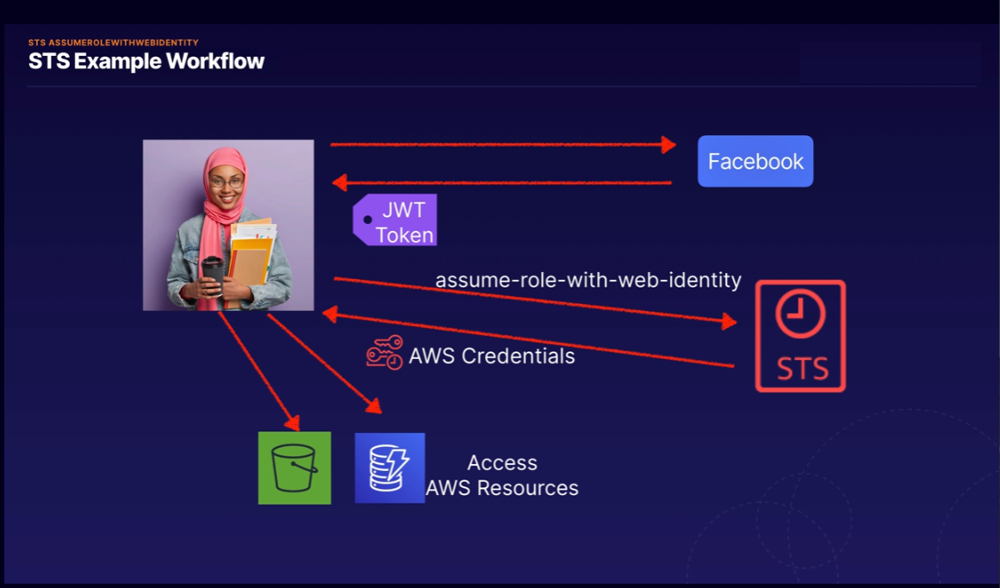

<h1> IAM </h1>

[//]:# (What is IAM?)

    

        <b><big><big>
            What is IAM?
        </big></big></b>
    

**AWS Identity and Access Management (IAM)** - сервис, который предоставляет 
возможности безопасного управления доступом к сервисам и ресурсам AWS.
Используя IAM, можно создавать пользователей AWS и группы, управлять ими,
а также использовать разрешения, чтобы предоставлять или запрещать доступ к ресурсам AWS.

**Компоненты IAM**:
- Пользователи (Users)              - Кто управляет системой
- Группы (Groups)                   - Объединения пользователей и выдача им правил работы
- Полиси (Policies)                 - Правила доступа для сервисов и пользователей
- Роли (Roles)                      - Правила доступа работы сервисов
- сервис токенов безопасности (STS) - предоставление временного доступа к записям 

**Главные функции IAM**:
- Вы можете предоставить другим людям разрешение на администрирование 
  и использование ресурсов в вашей учетной записи AWS, не сообщая свой пароль или ключ доступа.
- Вы можете предоставлять разные разрешения разным людям для разных ресурсов.
- Вы можете предоставляnm вашим приложениям разрешения на доступ к другим ресурсам AWS.
- Вы можете добавить двухфакторную аутентификацию для своей учетной записи 
  и для отдельных пользователей для дополнительной безопасности.
- Вы можете разрешить пользователям использовать (STS) для получения временного доступа
  к вашей учетной записи AWS.
- Мониторинг информации об удостоверениях IAM, которые запрашивали ресурсы в вашей учетной записи.
- IAM подтвержден на соответствие стандарту безопасности данных индустрии платежных карт (PCI) (DSS).
- IAM и AWS Security Token Service (STS) предлагаются без дополнительной оплаты.

 

[//]:# (What is the allow/deny priority order when policies are configured on
        different levels [group, user,  etc.]?)

    

        <b><big><big>
            What is the allow/deny priority order when 
            policies are configured on different levels (group, user,  etc.)?
        </big></big></b>
    

Чтобы окончательно выставить приоритет проходятся следующие уровни проверок

1. **Неявное отрицание.**
   AWS оценивает все политики в аккаунте, применимые к запросу, 
   отклоняя запрос если находит Deny инструкцию
2. **Service control policies уровень.**
   AWS оценивает Service control policies применимые к организации.
   Если не находит никаких Allow в SCP, запрос неявно отклоняется.
3. **Политики на основе ресурсов.**
   Есть ли у запрошенного ресурса есть политика на основе ресурсов и эта политика 
   предоставляет Allow доступ. То запрос обрабатывается и это окончательное решение.
4. **IAM Граница разрешений (Permissions boundary)**
   Если политика, используемая для установки границы разрешений,
   не разрешает запрошенное действие, запрос отклоняется.
5. **Политика сессии**
   Если политика сеанса присутствует и не разрешает запрошенное действие, 
   запрос неявно отклоняется.
6. **Политики на основе идентификационных данных**
   Смотрятся политики пользователя и политики из групп, к которым принадлежит пользователь.
   Если какая-либо политика разрешает запрошенное действие, то решение окончательно «Разрешить».
   Если таких нет, то окончательно "Запретить"
7. **В любом месте проверки если находится ошибка** выбивается принудительное "Запретить"

Упрощенно:
- Проверка Аккаунта
- Проверка полиси организации
- Проверка полиси ресурсов (если allow на этом этапе то доспут дается, если нет идем дальше)
- Проверка IAM к пользователю
- Проверка сеанса сессии (если таковая имеется)
- Проверка групп в которых состоит пользователь

 

[//]:# (Programmatic access to AWS resources?)

    

        <b><big><big>
            Programmatic access to AWS resources?
        </big></big></b>
    

Доступ можно осуществить и через консоль. 
Все креды того или иного пользователя хранятся в папке ~/.aws/credentials

Консоль автоматически обращается за кредами в эту папку и пингует AWS сервисы для проверки
наличия полиси для указанного IAM профиля. 

 

[//]:# (How you can test IAM policy?)

    

        <b><big><big>
            How you can test IAM policy?
        </big></big></b>
    

IAM Policy Simulator

For:
- Test IAM permissions
- validate that the policy works as expected
- test policies attached to existing users for troubleshooting

 

[//]:# (Best IAM practices?)

    

        <b><big><big>
            Best IAM practices?
        </big></big></b>
    

- Заблокируйте ключи доступа корневого пользователя к своей учетной записи AWS
- Создание отдельных пользователей IAM
- Используйте группы для назначения разрешений пользователям IAM
- По возможности используйте политики, определенные AWS, для назначения разрешений
- Предоставить наименьшие привилегии
- Использование уровней доступа для просмотра разрешений IAM
- Настройте надежную политику паролей для ваших пользователей
- Включить MFA для привилегированных пользователей
- Используйте роли для приложений, работающих на инстансах Amazon EC2
- Используйте роли для делегирования разрешений
- Не сообщайте ключи доступа
- Регулярно меняйте учетные данные
- Удалить ненужные учетные данные
- Используйте условия политики для дополнительной безопасности
- Мониторинг активности в вашей учетной записи AWS

 

[//]:# (What is WIF Cognito "Web Identity federation Cognito" ?)

    

        <b><big><big>
            What is WIF Cognito "Web Identity federation Cognito" ?
        </big></big></b>
    

This is an authentication broker that allows you
 to connect to resources using your facebook, Google, amazon credentials

It provides the following features:
- Multi-Factor Authentication
- Synchronization of user data across multiple device types
- Sign-up and sign-in to your applications

- Temporary credentials
- Maps to IAM role
- Secure and Seamless "бесшовный" (not stored)

Consists of
- Users Pools
- Identity pools

 

[//]:# (What API call can be used to enable a user authenticated by Facebook?)

    

        <b><big><big>
            What API call can be used to enable a user authenticated by Facebook?
        </big></big></b>
    

**assume-role-with-web-identity** returns a set of temporary security credentials 
for users who have been authenticated in a mobile or web application with 
a web identity provider.

 

[//]:# (Cognito user pool workflow?)

    

        <b><big><big>
            Cognito user pool workflow?
        </big></big></b>
    

The user needs to authenticate with Facebook first, 
that will return a web identity token. 
Then AWS STS is called and passes the web identity token as input. 
AWS STS authorizes the call and provides temporary AWS access credentials. 
The user is allowed to assume an IAM role and access AWS resources 
in accordance with the role's security policy

 

[//]:# (User Pool vs Identity Pool?)

    

        <b><big><big>
            User Pool vs Identity Pool?
        </big></big></b>
    

User pool used to managed sign-up and sign-in functionality

Identity pool enable you to provide temporary AWS credentials
and enable access to AWS services like S3

 

[//]:# (IAM Managed policies/Customer managed policies/ ?)

    

        <b><big><big>
            User Pool vs Identity Pool?
        </big></big></b>
    

Managed policies — created and administered by AWS
AmazonDynamoDBFullAccess
- no need to write policy yourself
- attach to multiple users, groups, roles  
- you cannot change permissions

Customer managed policies
- Created by you
- Copy an Existing Policy
- Recommended when your needs are not covered by managed policies

Inline Policies
- 1:1 relationship
- when you delete user, group, a role in which policy is used, it also we be deleted
- in most cases AWS recommends using Managed policies over inline
- Used for single user, group, role

 

[//]:# (What is STS AssumeRoleWithWebIdentity?)

    

        <b><big><big>
            What is STS AssumeRoleWithWebIdentity?
        </big></big></b>
    

This is security token service api call.
This service is referenced with temporary credentials, now with IAM role or user

- STS API
- temporary credentials
- Web applications
- associated with temporary credentials

 

---

[//]:# (How we can ensure that user from identity pools can access only their own files in S3?)

    

        <b><big><big>
            How we can ensure that user from identity pools can access only their own files in S3?
        </big></big></b>
    

Use an IAM policy within the Amazon Cognito identity prefix 
to restrict users to use their own folders in Amazon S3.

As example:

    {
        "Sid": "ReadWriteDeleteYourObjects",
        "Effect": "Allow",
        "Action": [
            "s3:DeleteObject",
            "s3:GetObject",
            "s3:PutObject"
        ],
    "Resource": [
        "arn:aws:s3:::bucket-name/cognito/application-name/${cognito-identity.amazonaws.com:sub}/*"
        ]
    }

https://docs.aws.amazon.com/IAM/latest/UserGuide/reference_policies_examples_s3_cognito-bucket.html

 

