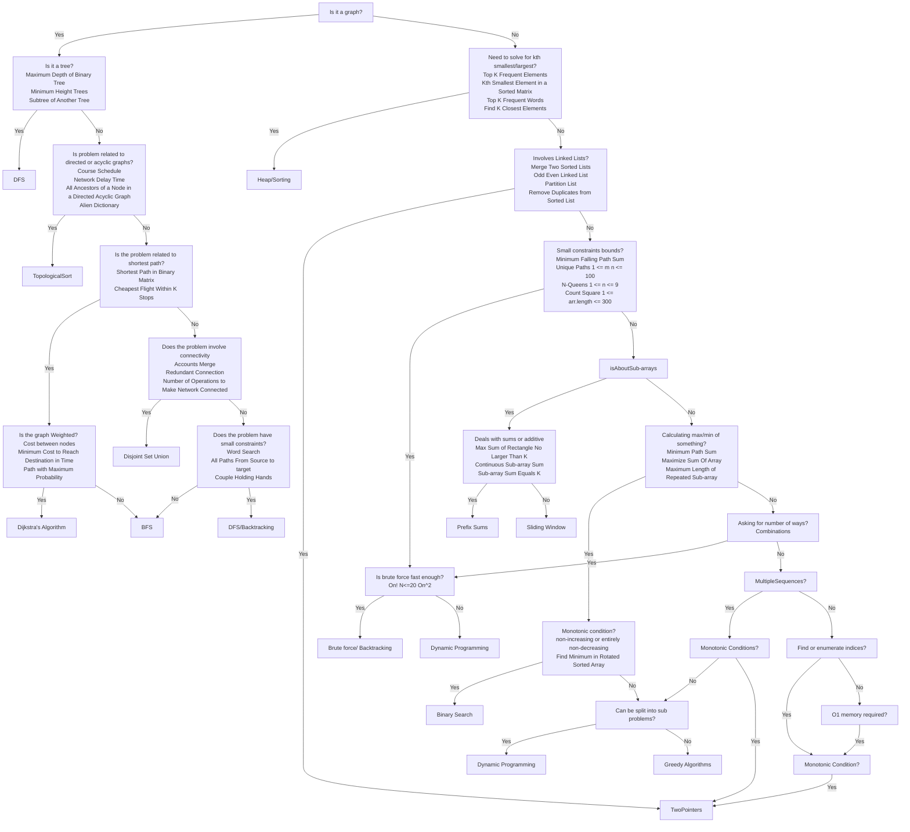

<h1>Algorithm</h1> 
<h4>

[Back to menu](..%2FMenu.md)

</h4>

<h2>

[Link to original chart](https://algo.monster/flowchart)

Topic list:
* [DFS](..%2Fsrc%2Fmain%2Fjava%2Falgorithm%2FDFS.java)
  
</h2>
 
