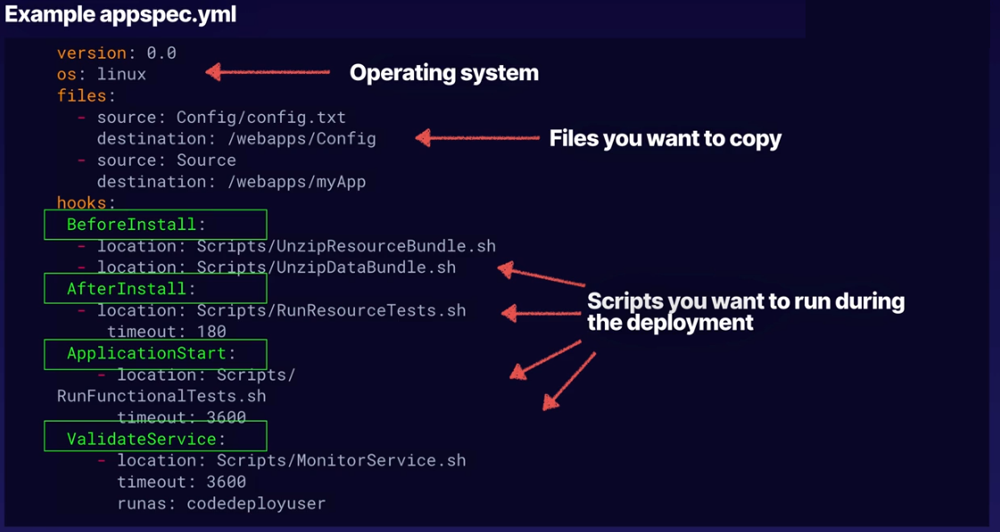

<h1>CI/CD</h1> 
<h4> 

[Back to menu](../../Menu.md)

</h4>

[//]: # (What is CI? What is CD "delivery"? What is CD "deployment"?)

    

        <b>
           What is stage, action and transition in CodePipeline?
        </b>
    

 

- **Pipeline:** is how software changes go through a release process

- **Stage:** A stage is a logical unit you can use to isolate an environment

- **Action:** An action is a set of operations performed on application code
and configured so that the actions run in the pipeline at a specified point. 

- **Transition:** Transitions are links between pipeline stages 
that can be disabled or enabled. They are enabled by default. 

https://docs.aws.amazon.com/codepipeline/latest/userguide/concepts.html

 

[//]: # ( What is deployment configuration for the AWS CodeDeploy?)

    

        <b>
             What is deployment configuration for the AWS CodeDeploy?
        </b>
    

 

In AWS CodeDeploy,
a deployment configuration is a set of rules and success and 
failure conditions used during a deployment.

The predefined deployment configurations for an EC2/on-premises compute platform are:

**In-place**: In this type of deployment, the application on each 
instance in the deployment group is stopped,
the latest application revision is installed, 
and the new version of the application is started and validated. 

You can use a load balancer so that each instance is deregistered 
during its deployment and then restored to service after the deployment is complete.

**Canary**: A small percentage of traffic is shifted to the new version, 
followed by a waiting period. 
If everything goes well, the remaining traffic is shifted.

**Linear**: Traffic is shifted in equal increments with
an equal wait time between each shift.

**All-at-once**: Attempts to deploy an application revision to as
many instances as possible at once. 
The status of the overall deployment is displayed as Succeeded 
if the application revision is deployed to one or more of the instances. 
The status of the overall deployment is displayed as Failed 
if the application revision is not deployed to any of the instance

 

[//]: # (What parts CodeDeploy consists off?)

    

        <b>
             What parts CodeDeploy consists off?
        </b>
    

 

- Code Commit - source and version control
- Code Build - automated build
- Code Deploy - automated deployment to Ec2, on-premise, lambda
- Code Pipeline - manages the workflow

 

[//]: # (What is deployment application specification for the AWS CodeDeploy? AppSpec) 

    

        <b>
            What is deployment application specification for the AWS CodeDeploy? "appSpec.yaml"
        </b>
    

 

The application specification file, or appSpec.yaml, 
is a **YAML or JSON-formatted file** used by AWS CodeDeploy to manage a deployment. 

It’s designed to manage deployments through a series of hooks, or events, 
defined in the Hooks section of the file.

For an **EC2/On-Premises** compute platform, 
the **appSpec.yaml** file must be placed in the root 
of the directory structure 
of an application’s source code. 
It is used by CodeDeploy to determine what to install onto your 
instances from your application revision in Amazon S3 or GitHub, 
and which lifecycle event hooks to run in response to deployment lifecycle events.

 

[//]: # (What are the key elements of an app spec "appSpec.yaml" in CodeDeploy?)

    

        <b>
           What are the key elements of an app spec "appSpec.yaml" in CodeDeploy?
        </b>
    

 

    version: reserved for future use
    os: OS version
    files: config files and packages
    permissions: 
    hooks: LiceCycle event hooks

 

[//]: # (What are hooks events that you can specify in "appSpec.yaml"?)

    

        <b>
           What are hooks events that you can specify in "appSpec.yaml"?
        </b>
    

 

This is special events that can be specified while code deploys.

They can be separated in 3 phases: 
- De-register instances from Load Balancer
- Application deployment phase
  - Application Stop
  - Download Bundle
  - Before/IN/After install steps
  - App start
  - Validate Service
- Re-register load balancer

 

[//]: # (What AWS CodeDeploy lifecycle hooks you know?)

    

        <b>
           What AWS CodeDeploy lifecycle hooks you know?
        </b>
    

 

- ApplicationStop
- BeforeInstall
- AfterInstall
- ApplicationStart
- ValidateService

 

[//]: # (What is code artifact?)

    

        <b>
           What is code artifact?
        </b>
    

 

Artifact repo makes easy for devs to find software packages

 

[//]: # (CodePipeline workflow?)

    

        <b>
           CodePipeline workflow
        </b>
    

 

- CodePipeline — begins when there is a change detected in code
- CodeCommit — new source code appears in the CodeCommit
- CodeBuild — immediately compiles source code, runs tests 
- CodeDeploy — newly build app is deployed into env

 

[//]: # (How would you notificate users that code are pushed to CodeCommit repo?)

    

        <b>
           How would you notificate users that code are pushed to CodeCommit repo?
        </b>
    

 

You can set up notification rules for a repository so that repository users 
receive emails about the repository event types you specify. 
Notifications are sent when events match the notification rule settings. 
You can create an Amazon SNS topic to use for notifications 
or use an existing one in your AWS account. 
You can use the CodeCommit console and the AWS CLI to configure 
notification rules.

**Amazon SES is not a valid target for CloudWatch Events**

 

[//]: # (What are the key elements of a build spec in CodeBuild?)

    

        <b>
           What are the key elements of an app spec in CodeBild?
        </b>
    

 

    version: 0.2
    phases:
      build:
    artifacts:
      files:

 

[//]: # (What 3rd party tools and other AWS services may participate CodePipeline execution?)

    

        <b>
           What 3rd party tools and other AWS services may participate CodePipeline execution?
        </b>
    

 

- AWS CodeCommit
- Amazon S3
- AWS CodeBuild
- AWS CodeDeploy
- AWS Elastic Beanstalk
- AWS CloudFormation
- AWS OpsWorks
- Amazon ECS
- AWS Lambda

 

[//]: # (What is Elastic Container Service?)

    

        <b>
           What is Elastic Container Service?
        </b>
    

 

- Similar to virtual machine
- standardized unit
- created using independent stateless components

pluses:
- highly scalable
- fault tolerant
- easy to update

- will run your counterfeiters on clusters of virtual EC2
- can use Fargate for serverless containers
- you can manage EC2 containers

 

[//]: # (What is Elastic Container Registry?)

    

        <b>
           What is Elastic Container Registry?
        </b>
    

 

This is where you can store your container images.
Docker or Windows Container.

 

[//]: # (What is AWS CodeArtifact?)

    

        <b>
           What is AWS CodeArtifact?
        </b>
    

 

AWS CodeArtifact is an artifact repository service that makes 
it easy for organizations to securely store, publish, and share 
software packages used in their software development process

 

[//]: # (Can public repository items be available in a CodeArtifact?)

    

        <b>
           Can public repository items be available in a CodeArtifact?
        </b>
    

 

You can add a connection between a CodeArtifact repository and an external, 
public repository, 
so that when developers request a package from the CodeArtifact repository
that's not already present in the repository, 
the package can be fetched from the external connection. 
This makes it possible to consume open-source dependencies 
used by your application.

 

---

[//]: # (CodeCommit events: what is pullRequestSourceBranchUpdated, pullRequestCreated event?)

    

        <b>
           CodeCommit events: what is pullRequestSourceBranchUpdated, pullRequestCreated event?
        </b>
    

 

pullRequestSourceBranchUpdated: Event when user updated the source branch for a pull request.

https://docs.aws.amazon.com/codecommit/latest/userguide/monitoring-events.html#pullRequestSourceBranchUpdated

pullRequestCreated: pull request was created

https://docs.aws.amazon.com/codecommit/latest/userguide/monitoring-events.html#pullRequestCreated

 
