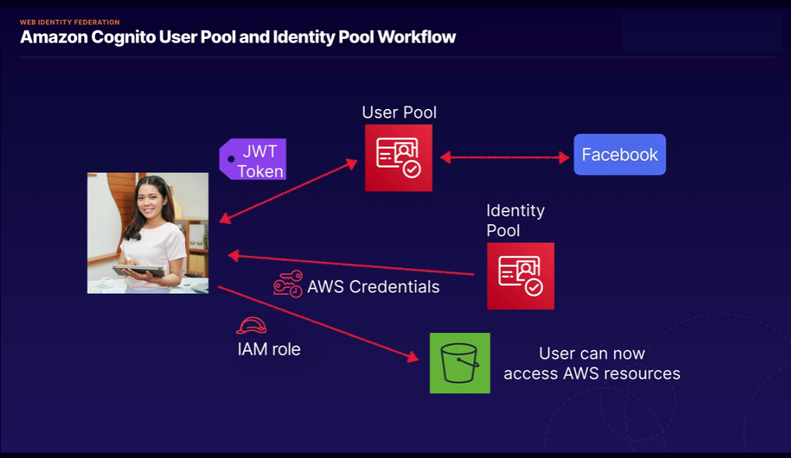
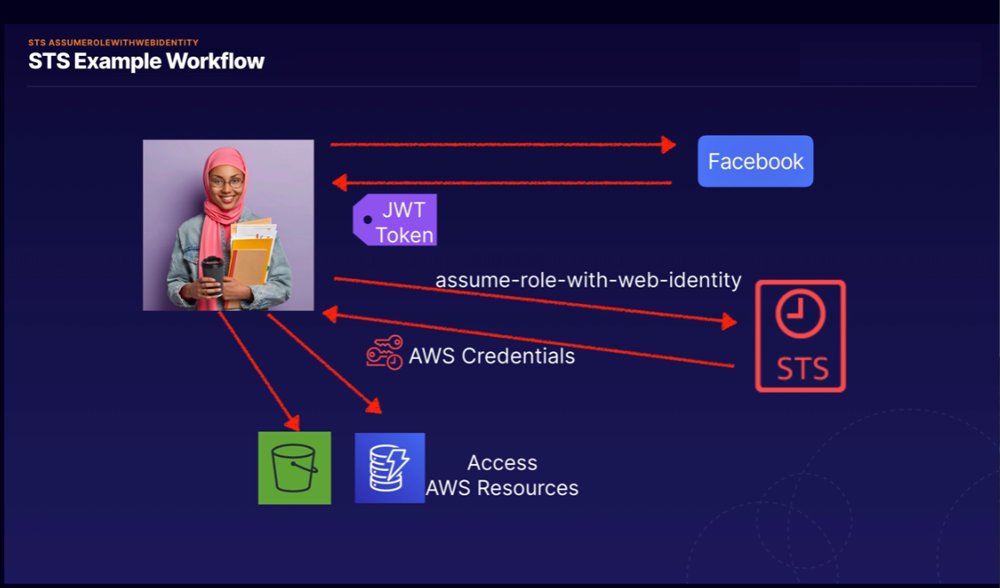

<h1> IAM </h1>
<h4> 

[Back to menu](../../Menu.md)

</h4>

[//]: # (What is IAM?)

    

        <b>
            What is IAM?
        </b>
    

 

**AWS Identity and Access Management (IAM)** is a service that provides
capabilities to securely control access to AWS services and resources.
Using IAM, you can create and manage AWS users and groups,
and use permissions to grant or deny access to AWS resources.

**IAM Components**:
- Users - Who controls the system
- Groups - Associations of users and issuing operating rules to them
- Policies - Access rules for services and users
- Roles - Access rules for services
- security token service (STS) - providing temporary access to records

**Main functions of IAM**:
- You can grant administration permission to other people
  and use resources in your AWS account without sharing your password or access key.
- You can grant different permissions to different people for different resources.
- You can grant your applications permissions to access other AWS resources.
- You can add two-factor authentication for your account
  and for individual users for additional security.
- You can allow users to use (STS) to gain temporary access
  to your AWS account.
- Monitor information about IAM identities that have requested resources in your account.
- IAM is certified to comply with the Payment Card Industry (PCI) 
Data Security Standard (DSS).
- IAM and AWS Security Token Service (STS) are offered at no additional cost.

 

[//]: # (What is the allow/deny priority order when policies are configured on
        different levels [group, user,  etc.]?)

    

        <b>
            What is the allow/deny priority order when 
            policies are configured on different levels (group, user,  etc.)?
        </b>
    

 

To finally set the priority, the following levels of checks are passed:

1. **Implicit denial.**
   AWS evaluates all policies in the account that apply to the request,
   rejecting the request if it finds a Deny instruction
2. **Service control policies level.**
   AWS evaluates the Service control policies applicable to the organization.
   If it does not find any Allows in SCP, the request is implicitly rejected.
3. **Resource-based policies.**
   Does the requested resource have a resource based policy and that policy
   grants Allow access. Then the request is processed and this is the final decision.
4. **IAM Permissions boundary**
   If the policy used to set the permission boundary is
   does not allow the requested action, the request is rejected.
5. **Session Policy**
   If the session policy is present and does not allow the requested action,
   the request is implicitly rejected.
6. **Identity-Based Policies**
   The user's policies and policies from the groups to which the user belongs are looked at.
   If any policy allows the requested action, then the decision is final "Allow".
   If there are none, then finally “Ban”
7. **At any point in the check if an error is found** the forced “Disable” is selected

Simplified:
- Account verification
- Checking the organization's policy
- Checking the resource policy (if allow at this stage, then access is given, if not, go further)
- IAM check for user
- Session session check (if any)
- Checking the groups the user belongs to

 

[//]: # (Programmatic access to AWS resources?)

    

        <b>
            Programmatic access to AWS resources?
        </b>
    

 

Access can also be achieved through the console.
All credentials of a particular user are stored in the ~/.aws/credentials folder

The console automatically requests credits to this folder 
and pings AWS services for verification
availability of a policy for the specified IAM profile.

 

[//]: # (How you can test IAM policy?)

    

        <b>
            How you can test IAM policy?
        </b>
    

 

IAM Policy Simulator

For:
- Test IAM permissions
- validate that the policy works as expected
- test policies attached to existing users for troubleshooting

 

[//]: # (Best IAM practices?)

    

        <b>
            Best IAM practices?
        </b>
    

 

- Lock the root user's access keys to your AWS account
- Create individual IAM users
- Use groups to assign permissions to IAM users
- Whenever possible, use policies defined by AWS to assign permissions
- Grant least privilege
- Using access levels to view IAM permissions
- Set up a strong password policy for your users
- Enable MFA for privileged users
- Use roles for applications running on Amazon EC2 instances
- Use roles to delegate permissions
- Do not share access keys
- Change your credentials regularly
- Remove unnecessary credentials
- Use policy terms for added security
- Monitor activity in your AWS account

 

[//]: # (What is WIF Cognito "Web Identity federation Cognito" ?)

    

        <b>
            What is WIF Cognito "Web Identity federation Cognito" ?
        </b>
    

 

This is an authentication broker that allows you
 to connect to resources using your facebook, Google, amazon credentials

It provides the following features:
- Multi-Factor Authentication
- Synchronization of user data across multiple device types
- Sign-up and sign-in to your applications

- Temporary credentials
- Maps to IAM role
- Secure and Seamless "бесшовный" (not stored)

Consists of
- Users Pools
- Identity pools

 

[//]: # (What API call can be used to enable a user authenticated by Facebook?)

    

        <b>
            What API call can be used to enable a user authenticated by Facebook?
        </b>
    

 

**assume-role-with-web-identity** returns a set of temporary security credentials 
for users who have been authenticated in a mobile or web application with 
a web identity provider.

 

[//]: # (Cognito user pool workflow?)

    

        <b>
            Cognito user pool workflow?
        </b>
    

 

The user needs to authenticate with Facebook first, 
that will return a web identity token. 
Then AWS STS is called and passes the web identity token as input. 
AWS STS authorizes the call and provides temporary AWS access credentials. 
The user is allowed to assume an IAM role and access AWS resources 
in accordance with the role's security policy

 

[//]: # (User Pool vs Identity Pool?)

    

        <b>
            User Pool vs Identity Pool?
        </b>
    

 

User pool used to managed sign-up and sign-in functionality

Identity pool enable you to provide temporary AWS credentials
and enable access to AWS services like S3

 

[//]: # (IAM Managed policies/Customer managed policies/ ?)

    

        <b>
            User Pool vs Identity Pool?
        </b>
    

 

Managed policies — created and administered by AWS
AmazonDynamoDBFullAccess
- no need to write policy yourself
- attach to multiple users, groups, roles  
- you cannot change permissions

Customer managed policies
- Created by you
- Copy an Existing Policy
- Recommended when your needs are not covered by managed policies

Inline Policies
- 1:1 relationship
- when you delete user, group, a role in which policy is used, it also we be deleted
- in most cases AWS recommends using Managed policies over inline
- Used for single user, group, role

 

[//]: # (What is STS AssumeRoleWithWebIdentity?)

    

        <b>
            What is STS AssumeRoleWithWebIdentity?
        </b>
    

 

This is security token service api call.
This service is referenced with temporary credentials, now with IAM role or user

- STS API
- temporary credentials
- Web applications
- associated with temporary credentials

 

---

[//]: # (How we can ensure that user from identity pools can access only their own files in S3?)

    

        <b>
            How we can ensure that user from identity pools can access only their own files in S3?
        </b>
    

 

Use an IAM policy within the Amazon Cognito identity prefix 
to restrict users to use their own folders in Amazon S3.

As example:

    {
        "Sid": "ReadWriteDeleteYourObjects",
        "Effect": "Allow",
        "Action": [
            "s3:DeleteObject",
            "s3:GetObject",
            "s3:PutObject"
        ],
    "Resource": [
        "arn:aws:s3:::bucket-name/cognito/application-name/${cognito-identity.amazonaws.com:sub}/*"
        ]
    }

https://docs.aws.amazon.com/IAM/latest/UserGuide/reference_policies_examples_s3_cognito-bucket.html

 

